# 기계학습을 위한 데이터 엔지니어링 - 기말과제
- 아주대학원 지능형 소프트웨어 공학과 202533163 박주형

## 데이터 결측치 탐지 및 제거
- 결측치 탐지 항목
  - Null Count: 데이터에 Null 값이 있는지 확인합니다.
  - Non-Numeric Count: 데이터에 숫자가 아닌 값이 있는지 확인합니다.
  - Negative Value Count: 데이터에 음수가 있는지 확인합니다. 

| Column Name           | Null Count | Non-Numeric Count | Negative Value Count |
|-----------------------|------------|-------------------|----------------------|
| `fixed acidity`       | 0          | 0                 | 0                    |
| `volatile acidity`    | 0          | 0                 | 0                    |
| `citric acid`         | 0          | 0                 | 0                    |
| `residual sugar`      | 0          | 0                 | 0                    |
| `chlorides`           | 0          | 0                 | 0                    |
| `free sulfur dioxide` | 0          | 0                 | 0                    |
| `total sulfur dioxide`| 0          | 0                 | 0                    |
| `density`             | 0          | 0                 | 0                    |
| `pH`                  | 0          | 0                 | 0                    |
| `sulphates`           | 0          | 0                 | 0                    |
| `alcohol`             | 0          | 0                 | 0                    |
| `quality`             | 0          | 0                 | 0                    |

- 결측치 탐지 결과 해당하는 데이터가 없기 때문에 제거하지 않습니다.

> 코드는 training.ipynb 참조

   

## 필드 선정
### 일반적인 접근
- 목표 데이터 quality는 맛과 관련이 있으므로 맛과 관련이 있는 feature 선정
  - `volatile acidity` : 휘발성 산도: 와인에 함유된 아세트산의 양. 너무 높으면 불쾌한 식초 맛이 날 수 있음
  - `citric acid` : 구연산: 소량으로 발견되며, 와인에 풍미를 더할 수 있음
  - `residual sugar` : 잔여 당분: 발효가 멈춘 후 남은 설탕의 양으로 1g/L 미만의 와인은 드물며 45g/L 이상의 와인은 단맛으로 간주함
  - `total sulfur dioxide` : 총 이산화황: 저농도에서는 대부분 맛이 나지 않으나 50ppm 이상의 농도에서 맛에서 뚜렷하게 나타남
  - `sulphates` : 황산염: 이산화황 농도에 기여할 수 있는 와인 첨가제. 항균 및 항산화제로 작용

### 알고리즘 접근
- 각 column과 quality간의 상관관계를 분석합니다.
- 여러 필드의 복합적인 관계를 파악하지 못하기에 참고용으로 사용합니다.
- 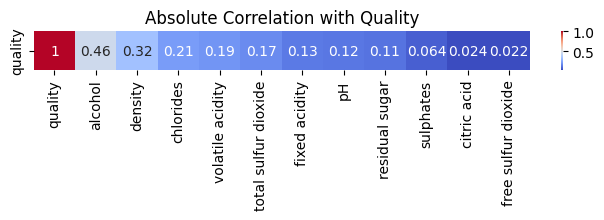
- 하위 6항목 선정
  - `fixed acidity`
  - `pH`
  - `residual sugar`
  - `sulphates`
  - `citric acid`
  - `free sulfur dioxide`
- 상위 5항목 선정
  - `alchol`
  - `density`
  - `chlorides`
  - `volatile acidity`
  - `sulphates`
  - `total sulfur dioxide`

### 최종 필드 선정
- 상관관계 알고리즘을 통한 상위 5항목과 일반적인 맛과 관련있는 항목을 합하여 선정합니다.
- 제거할 항목
  - `fixed acidity`
  - `pH`
  - `free sulfur dioxide`

> 코드는 training.ipynb 참조

   

## 이상치 탐지
- 데이터의 각 column의 분포를 확인합니다.
  - 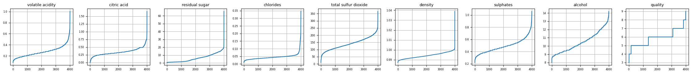
- 데이터 중에 데이터의 이상치를 판별합니다.
  - 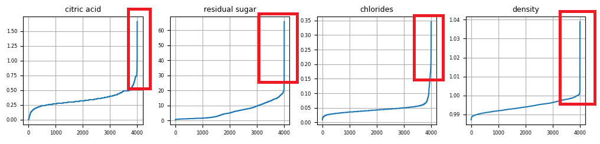
  - citric acid나 residual suger, chlorides, density가 유난히 높은 수치를 보이는 데이터가 존재합니다.
  - 하지만 이 데이터가 특이한 현상을 설명하는 단초가 될 수 있습니다.
  - 해당하는 column중에서 정규분포 3%를 벗어나는 데이터 즉 z-score가 3 이상인 데이터 중에서 quality 값이 5~7값인 데이터를 제거합니다.
- 해당하는 146개의 데이터를 제거합니다.
  - 이상치 제거한 결과
  - 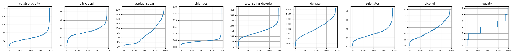
  - chlorides 값이 아직 특이한 형상을 보이는데, 중요한 단서가 될 수 있어 더이상 이상치를 제거하지 않습니다.
  - 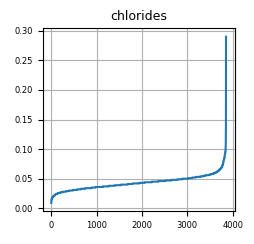

> 코드는 training.ipynb 참조

   

## 알고리즘 선정
- automl 즉 pycaret을 통해 최적의 알고리즘을 검색합니다.
- 데이터는 quality를 제외하고 minmax 통해 normalize 합니다.
  - 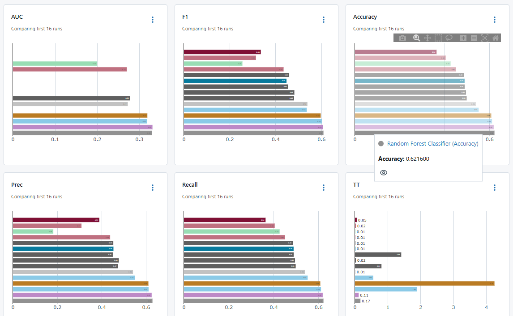

| Model     |   F1   | Kappa  |  MCC   | TT (Sec) |
|-----------|--------|--------|--------|----------|
| `rf`      | 0.6084 | 0.4237 | 0.4302 |   0.166  |
| `et`      | 0.6057 | 0.4195 | 0.4258 |   0.112  |
| `lightgbm`| 0.6013 | 0.4146 | 0.4179 |   1.891  |
| `catboost`| 0.5962 | 0.4077 | 0.4117 |   4.248  |
| `gbc`     | 0.5355 | 0.3133 | 0.3207 |   0.559  |
| `dt`      | 0.5384 | 0.3312 | 0.3317 |   0.013  |
| `knn`     | 0.4802 | 0.2420 | 0.2439 |   0.807  |

- 최종적으로 Random Forest 알고리즘으로 선정합니다.
- 마지막으로 Deep Learning 방식도 비교하여 선정합니다.

> 코드는 automl/automl.py 참조

   

## 파라미터 선정

### Random Forest
- MlFlow를 통해 뛰어난 Random Forest, Deep Learning의 파라미터를 획득합니다.

| 파라미터            | 설명                                | 예시 값                                |
| ------------------- | ----------------------------------  | ------------------------------------- |
| `n_estimators`      | 생성할 트리의 수                     | 50, 100, 200                          |
| `max_depth`         | 개별 트리의 최대 깊이                | None, 10, 20                          |
| `min_samples_split` | 노드를 분할하기 위한 최소 샘플 수     | 2, 5                                  |
| `min_samples_leaf`  | 리프 노드가 되기 위한 최소 샘플 수.   | 1, 2, 4                               |
| `max_features`      | 각 트리의 분할 시 고려할 최대 특성 수 | `'sqrt'`, `'log2'`                    |
| `bootstrap`         | 부트스트랩 샘플링 여부 (샘플을 중복 허용해 추출) | `True`, `False`            |
| `criterion`         | 분할 품질을 측정하는 기준.           | `'squared_error'`, `'absolute_error'` |

- 선정 결과
  - 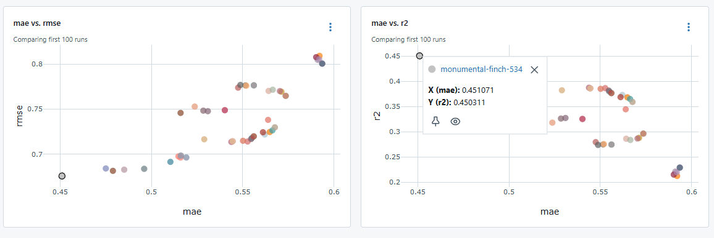
- 파라미터
  - | Name | Value |
    | ---- | ----- |
    | `bootstrap` | False |
    | `criterion` | squared_error |
    | `max_depth` | 20 |
    | `max_features` | log2 |
    | `min_samples_leaf` | 1 |
    | `min_samples_split` | 2 |
    | `n_estimators` | 200 |

> 코드는 mlflow/randomforest.py 참조

### Deep Learning

- Optimizer, Activation, Loss_fn 파라미터 조회
  - 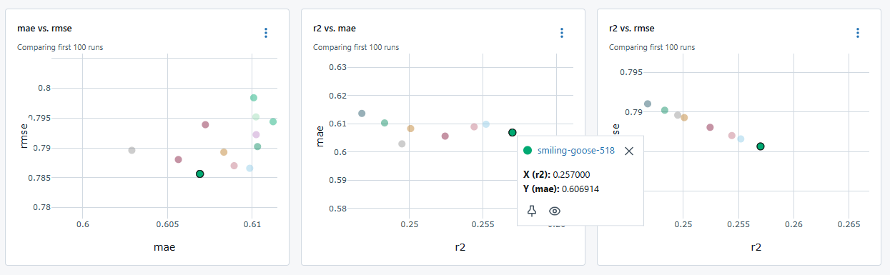
  - | Name | Value |
    | ---- | ----- |
    | `activation` | tanh |
    | `dropout_rate` | 0.3 |
    | `kernel_initializer` | glorot_uniform |
    | `learning_rate`	| 0.001 |
    | `loss_fn` | mse |
    | `optimizer` | adam |
  - data 분포가 tanh와 유사해서 그런지 activation이 tanh가 유리한 것을 확인했습니다.
- 레이어 조회
  - 1차 레이어 판별
    - 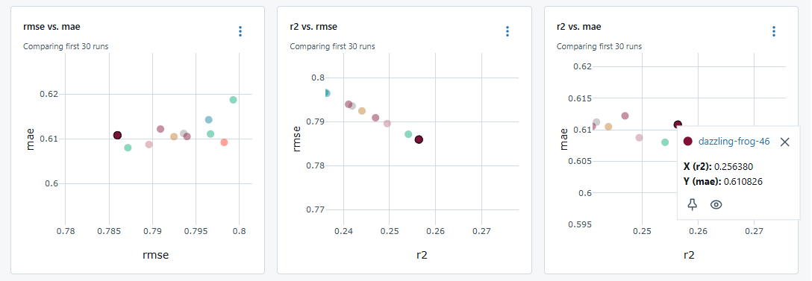
  - 2차 레이어 판별
    - 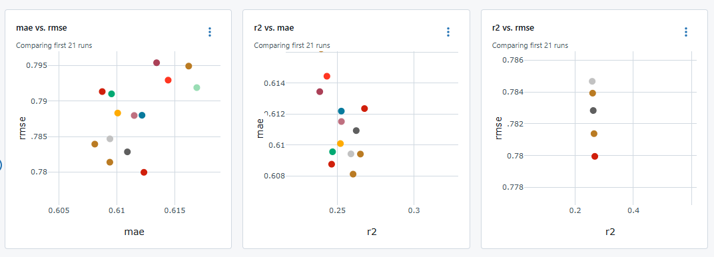
  - 3차 레이어 판별
    - 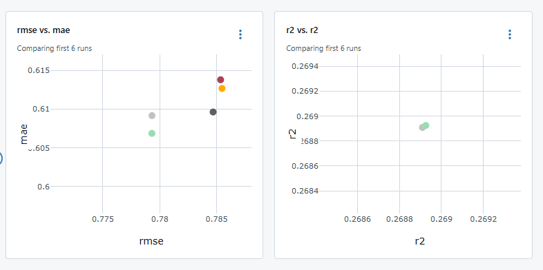
  - |   실험 단계   | 시도한 hidden_units_list                                                                               |
    | :-------: | :---------------------------------------------------------------------------------------------------- |
    | **1차 시도** | `[[8,8,8,8], [8,8], [64], [16,16], [32,32], [32,32,32], [64,32], [64,64], [64,32,16,8], [128,64,32]]` |
    | **2차 시도** | `[[8], [16], [32], [64], [128], [64,8], [64,32]]`                                                     |
    | **3차 시도** | `[[64], [128]]`                                                                                       |
    | **최종 선택** | `[64]`                                                                                                |

> 코드는 "mlflow/Keras Deeplearning" 폴더 참고

   

## 결과

### RandomForest

- MAE: 0.7620
- MSE: 0.9113
- RMSE: 0.9546
- R²: -0.1012
- Confusion Matrix
  - 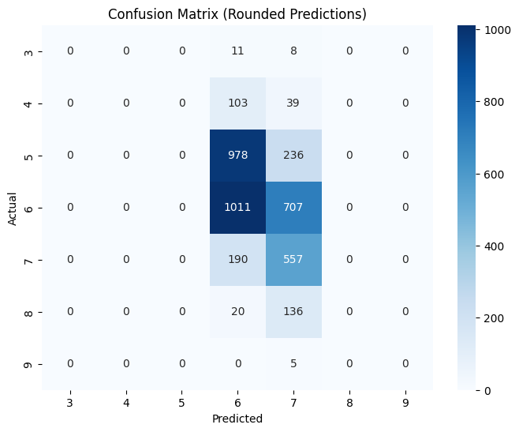
- ROC Curve
  - 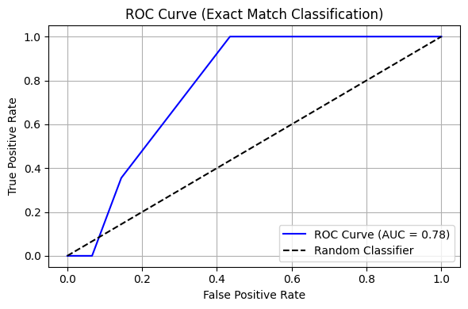

### Deep Learning

- MAE: 0.5778
- MSE: 0.5418
- RMSE: 0.7360
- R²: 0.3580
- loss: 0.5439
- val_loss: 0.6014
- Confusion Matrix
  - 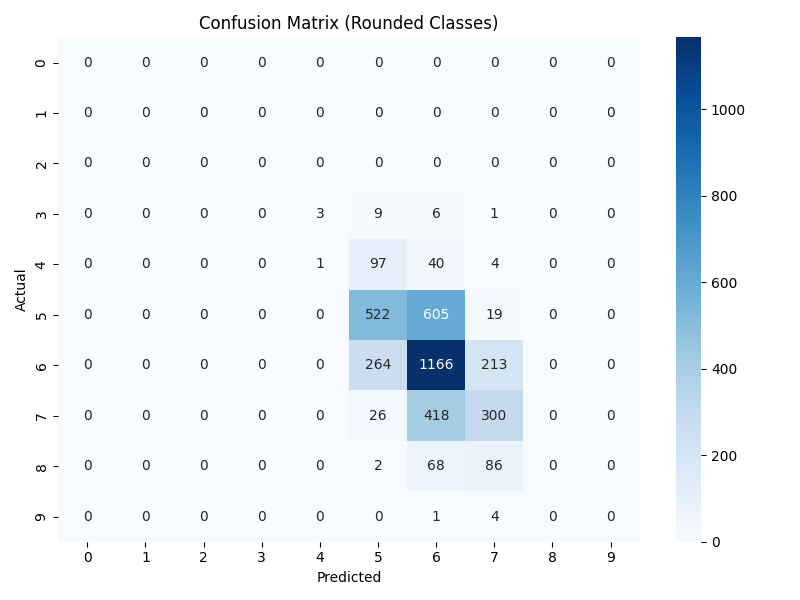
- ROC Curve
  - 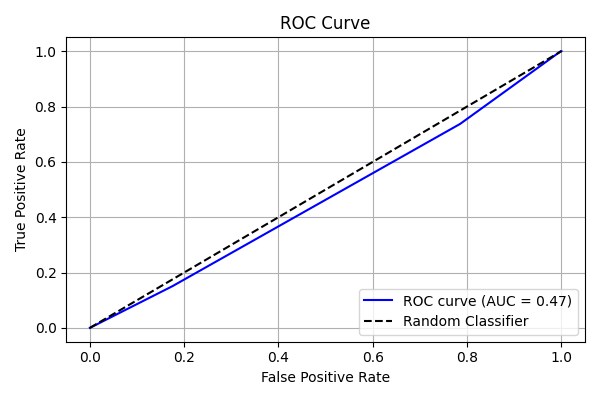

> 코드는 training.ipynb, "mlflow/Keras Deeplearning/keas_dl_validation.py" 참고

   

## 고찰
- RandomForest
  - 데이터 전처리 방법이나 모델 input, output 규격에 대해서 다양한 시도를 더 해야되겠다고 생각이 듭니다.
  - 특히 softmax 방법도 시도해보면 좋겠다고 생각이 듭니다.
- DeepLearning
  - mlflow로 데이터 학습 성능을 측정하는데 acc, loss를 검토하지 못 한점이 크게 작용한 것으로 생각이 됩니다.
  - feature 선정 방법도 다양한 방식을 시도하는 것도 좋다 생각이 듭니다.
  - softmax뿐만 아니라 여러 파리미터로 테스트해보면 어떨까 생각이 듭니다.

  
최종적으로는 RandomForest방법이 더 뛰어나기는 했으나, DeepLearning 방법으로도 충분한 성능이 나오게 시도해보고 싶습니다.  
향후 더 다양한 방법으로 여러 시도를 해서 모델 최적화를 위한 기술을 익혀야 되겠습니다.  
감사합니다.