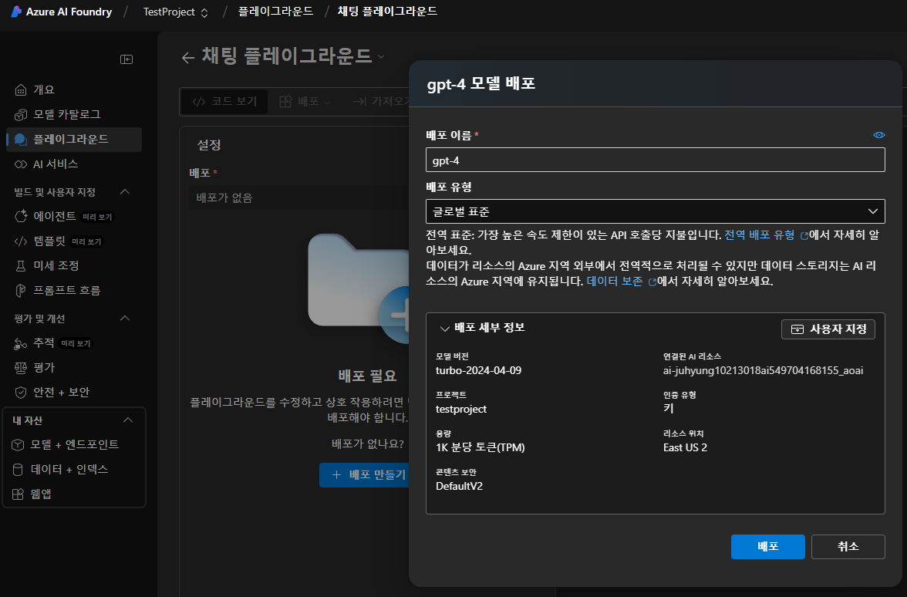
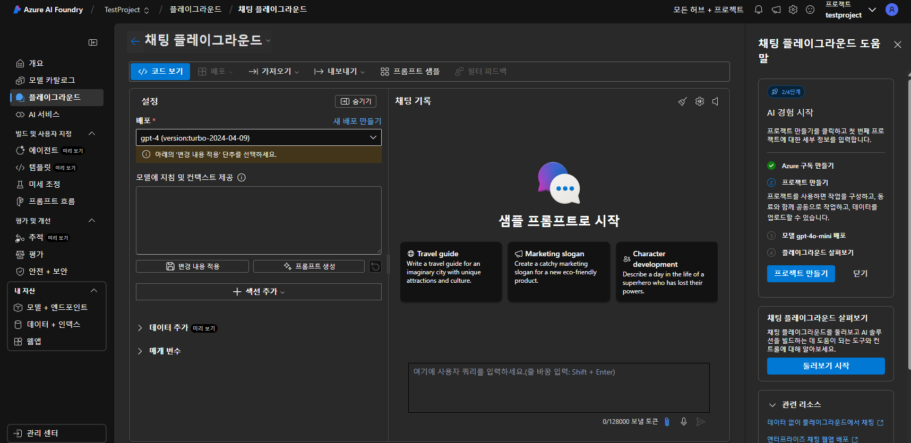

# Semantic Kernel
- https://github.com/microsoft/semantic-kernel
- https://learn.microsoft.com/en-us/semantic-kernel/get-started/quick-start-guide?pivots=programming-language-csharp

# Nuget Package
- Microsoft.SemanticKernel
- Microsoft.SemanticKernel.Abstractions
- Microsoft.SemanticKernel.Core
- Microsoft.Extensions.Logging
- Microsoft.Extensions.Logging.Console

# OpenAI Chat Assign
1. Azure 가입 
   - https://portal.azure.com/#home
2. Azure Subscription 추가
3. Azure AI Foundry에서 프로젝트 추가
   - Azure AI Foundry
     - https://ai.azure.com/?tid=95542951-ee98-405d-a440-ef946c568119
4. Azure 채팅 플레이 그라운드에서 Chat 배포
   - 
   - Chat Test 성공
   - 